###
**Camera Calibration**

#### 
**1. Calculate camera matrix and distortion coefficients. **

The code for this step is contained in lines 10 - 37 of the file called advanced_lane_finding.py. 

Basically, it's composed of two steps:

1.  get the object points
1.  compute the camera matrix and distortion coefficients. 

As done in the lecture, I start by preparing "object points", which are like  (x, y, z) coordinates of the chessboard corners in the world. As the chessboard is fixed on the (x, y) plane at z=0, such that the object points are the same for each calibration image. Thus, `objp` is just a replicated array of coordinates, and `objpoints` will be appended with a copy of it every time I successfully detect all chessboard corners in a test image. `imgpoints` will be appended with the (x, y) pixel position of each of the corners in the image plane with each successful chessboard detection.

I then used the output `objpoints` and `imgpoints` to compute the camera calibration and distortion coefficients using the `cv2.calibrateCamera()` function. I applied this distortion correction to the test image using the `cv2.undistort()`function and obtained this result:

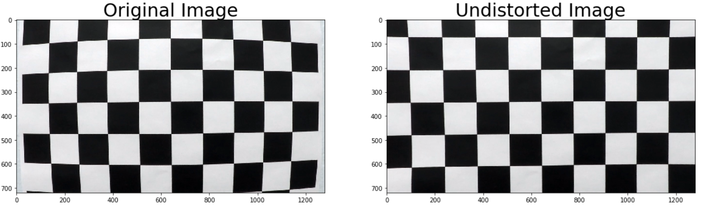

Figure 1. Camera calibration

### 
**Pipeline (single images)**

The pipeline is composed with the following 4 steps. The function draw_lane (line 301 - 343 in advanced_lane_finding.py) is the concrete implementation of the pipeline.

*   Undistort image
*   Create threshold binary image
*   Get bird-view perspective
*   Identify lane pixel and fit with quadratic curve
*   Map the lane found in bird-view perspective back to image

#### 
**1. Correct distortion.**

As we computed camera matrix and distortion coefficients in the Camera Calibration step, we could easily undistort images by calling cv2.undistort() function. Corresponding function _undistort_img_ (line 46 - 48) in _advanced_lane_finding.py_ is used to correct distortion.

Figure 2 illustrates the before and after effect of distortion correction step. We could clearly see the change of car front cover at the bottom of the image.

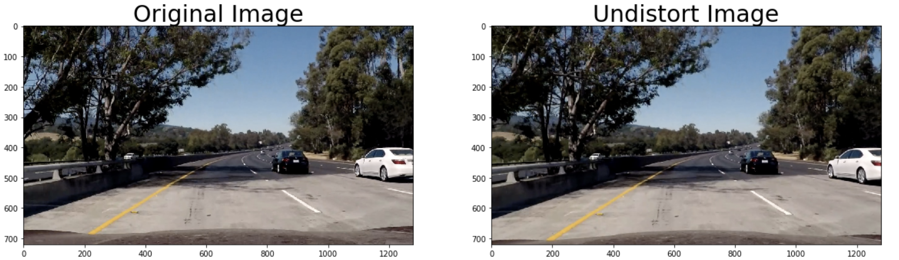

Figure 2. Distortion correction

#### 
**2. Create thresholded binary image.**

To create binary image, color transform and gradient techniques are applied in the following way (function _detect_lane_boarder_ line 106 - 115 in _advanced_lane_finding.py_):

*   Apply HLS color transform
*   Compute gradients on L channel and S channel
*   Combine gradients of two channels 

As shown in Figure 3, the final binary image could well capture both the yellow and white lane in the image, even in the presence of tree shadow.

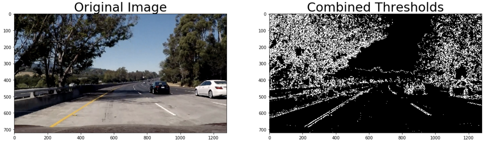

Figure 3. Final binary image 

I used gradients of both L channel and S channel to generate binary image, because I found that L chanel and S channel are good at capturing different features. By combining features from both channels, I would end up with more complete binary lane lines.

S channel could capture both yellow and white lane very well, however, it fails in the case of heavy dark shadow, as shown in Figure 5, the right lane covered by shadow is not well presented in the binary image. While, L channel happens to capture the right lane covered by shadow very well, as shown in Figure 4.

The disadvantage of L channel is, it performs very badly in terms of detecting yellow lane, which is the strength of S channel. You could clearly see this difference by comparing Figure 4 with Figure 5 in the left bottom.

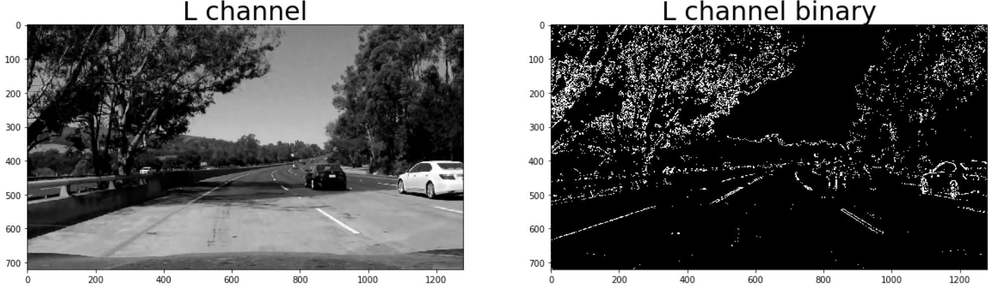

Figure 4.  L channel binary image

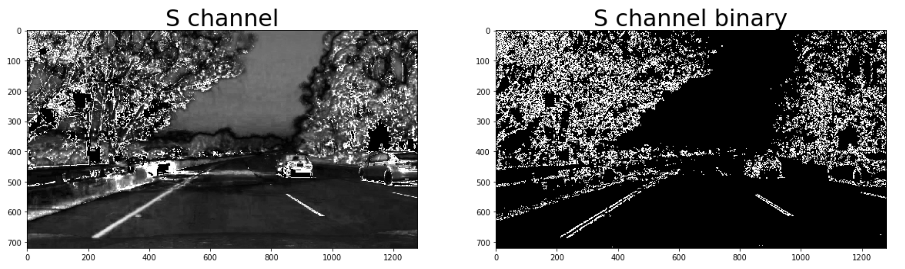

Figure 5. S channel binary image

As for the gradients, I combined gradients at x orientation and y orientation as well as the magnitude of gradients. (function _Combine_thresh_ Line 96 - 99 in _advanced_lane_finding.py_)

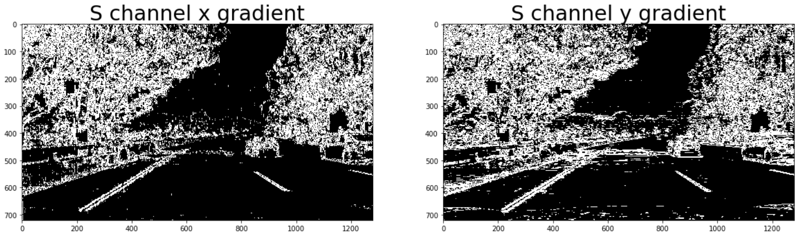

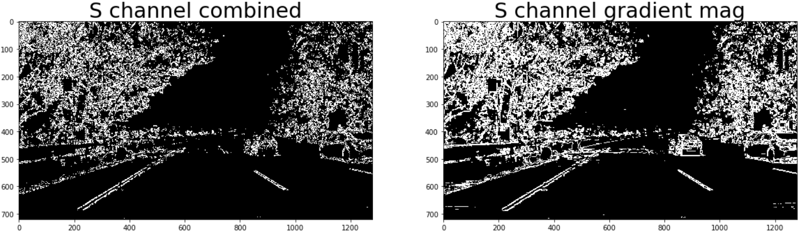

Figure 6. S channel gradients

As you could see in Figure 6, by combining gradients at x orientation, y orientation and take its magnitude into consideration, we could filter out as much as noise and well reserve the lane pixels at the same time.

#### 
**3. Perform perspective transform**

perspective transform is done with two functions in my code, function _get_perspective_matrix _(line 118 - 126) function _warp_image_ (line 129 - 131) in advanced_lane_finding.py.

#### 
To get the perspective matrix, I used four points in the straight line image. The position of the points are listed below:

src = [[190, 720], [585, 455], [700, 455], [1120, 720]]

dst = [[190, 720], [190, 0], [1120, 0], [1120, 720]]

#### 
I verified that my perspective transform worked as expected by drawing the `src` and `dst` points onto a test image and its warped counterpart to verify that the lines appear parallel in the warped image. This is shown in Figure 7.

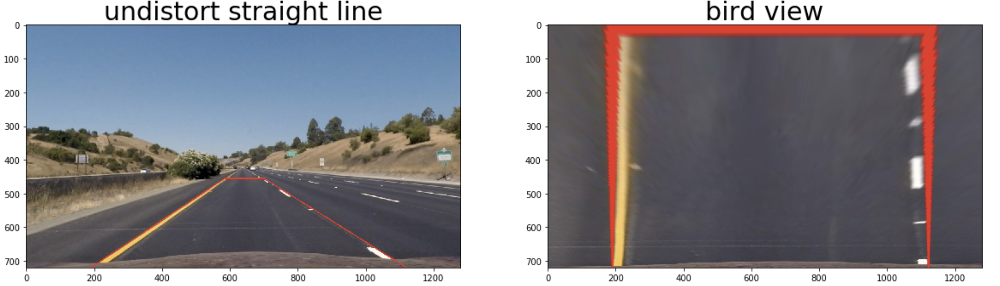

Figure 7. Perspective transform

By applying both distortion correction and perspective transform to test image, we could get a bird view of the lanes.

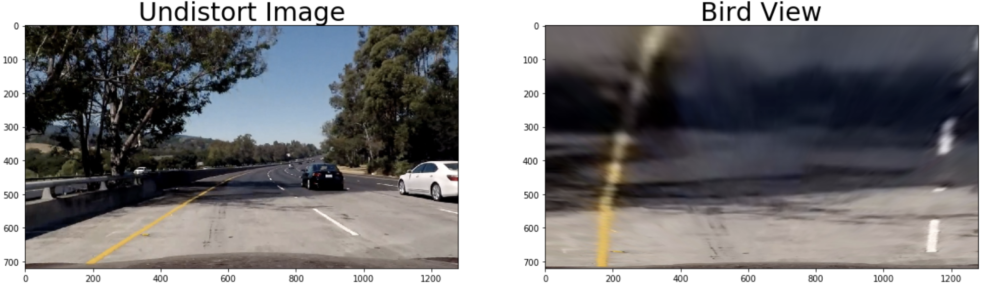

Figure 8. Bird view of lanes

#### 
**4. Identify lane-line pixels and fit with a polynomial**

With binary image of lanes in bird-view, we could identify the lane-line pixels with function _find_lane_with_sliding_window_ (line 147 - 176) for the first time and later with function find_lane_within_margin (line 237 - 262).

These two functions are based on the example code given in lecture 33.

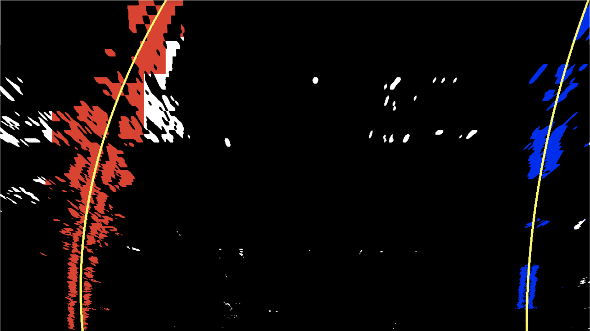

Figure 9. Lane pixel identification and lane fitting

#### 
**5. Calculate radius of curvature of the lane and the position of the vehicle with respect to center.**

Radius of curvature is calculated by function _Calculate_curvature_ (line 140 - 144), which is concrete example of the formula below:

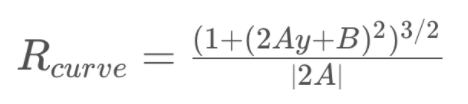

Vehicle's distance from center is calculated by _line 225 to 229 _in advanced_lane_finding.py.

To get the difference between center of the lane and the center of the car, the basic idea is:

*   First of all, calculate pixel distance from the vehicle to lane center.
*   Secondly, convert from pixel space to real world.

Assuming that the camera is fixed in the center of car's front cover, the center of the car is just the middle of the image. Lane center is the middle point of left lane and right lane.

In summary, vehicle's distance from center can be formulated as below:

_Distance = (lane_center - camera_center)*meter_per_pixel_

#### 
**6. Final result.**

The pipeline is implemented by _function draw_lane_ ( line 370 - 382 in advanced_lane_finding.py).

*   Undistort image (line 304)
*   Create threshold binary image (line 305)
*   Get bird-view perspective (line 306)
*   Identify lane pixel and fit with quadratic curve (line 308 - 336)
*   Map the lane found in bird-view perspective back to image (line 341)

Below is the final result of test image: 

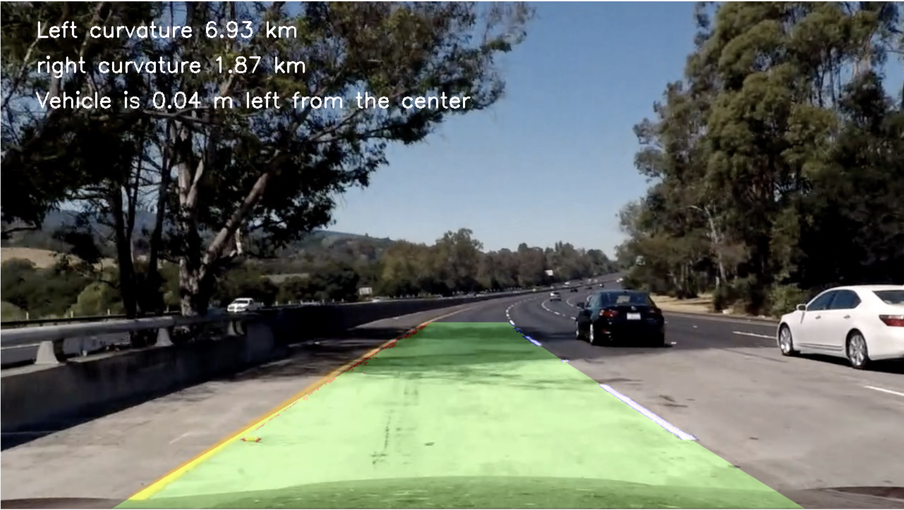

Figure 10. Final result

---

### 
**Pipeline (video)**

#### 
**Link to my final output video:**

[CarND advanced lane finding](https://youtu.be/1oao2i75GWE)

---

### 
**Discussion**

#### 
**1. Briefly discuss any problems / issues you faced in your implementation of this project. Where will your pipeline likely fail? What could you do to make it more robust?**

The pipeline fails in the following occasions:

*   When the road is covered with large areas of shadow
*   When the road is of light color and doesn't contrast with road lane lines
*   When the road is road lane is blur and look like color faded

To make it more robust:

*   When the pipeline fails, take advantage of the lane and curvature computed in the preceding frames and predict the lanes.
*   When the road is too light, deepen the contrast before processing
